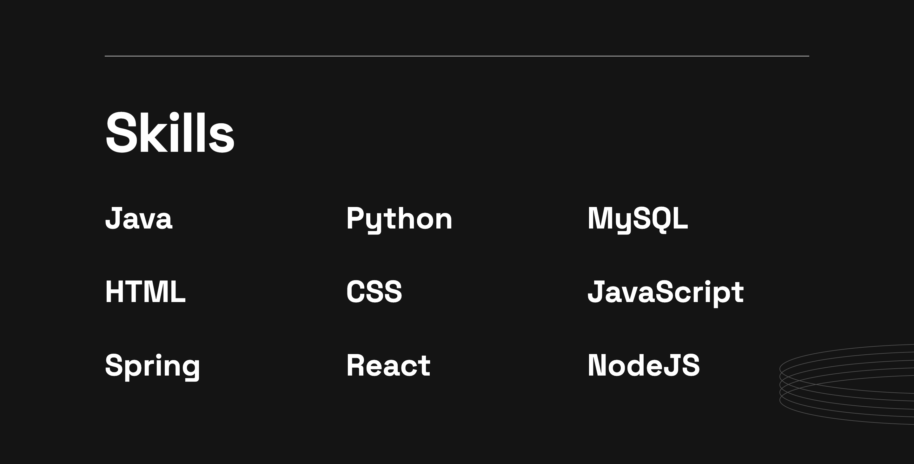

# My-Portfolio-V2

---

### Description.

#### This website shows some information about my career.I categorize them into sections.
* About Me.
* Top Skills.
* Projects.
* Contact Details.

#### This website is Optimized to Provide for All Mobile & Desktop Devices you Can View.

---

# Reference Links

📍 Site-Map: https://www.gloomaps.com/vT4ACwfNgm

🕸️ Wire-Frame: https://wireframe.cc/ucgFIq

️️🖼️ Mock Up: https://www.figma.com/file/jQnC6N1hGYFQSkn4XJuu7i/Untitled?node-id=0%3A1&t=HsFVd0RoNnzYPPiZ-1

🌐 000webhost: https://kasunweerasinghe.000webhostapp.com/

📃 GitHub Page URL: https://kasunweerasinghe.github.io/My-Portfolio-V2/

🔗 Linked-in URL: https://www.linkedin.com/in/kasun-r-weerasinghe/

---

### Languages & Tools

* HTML
* CSS
* Intellij IDEA
---

# Portfolio View.

### profile

### Skills

### Projects

### Projects with Hover Effect

### Contact

---
